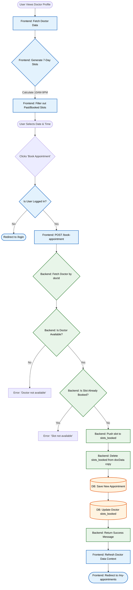
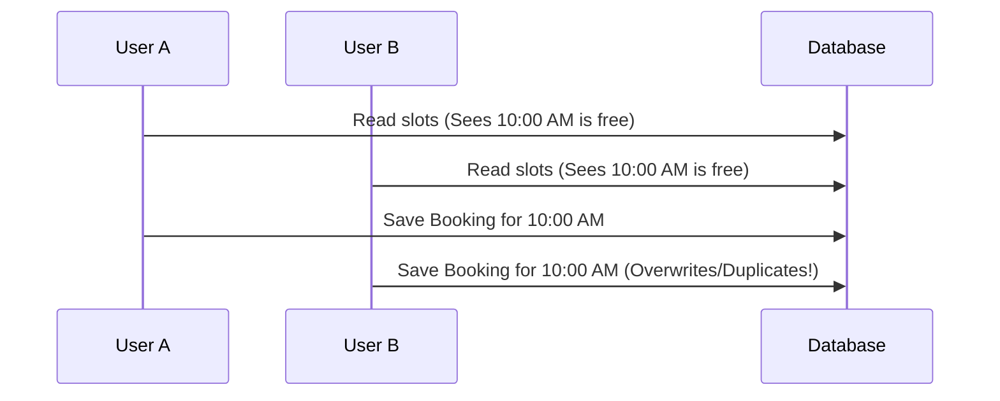

# 🗓️ The Booking Engine Flow

This document outlines the core business logic of the **Prescripto** platform: the Appointment Booking Engine. It explains how the frontend generates available time slots, how the backend processes the booking, and includes **30 advanced interview questions** to master this feature.

---

## 📊 Booking Procedure Flowchart

Below is a detailed Mermaid flowchart visualizing the end-to-end appointment booking process.



---

## 📖 How It Works (In Plain English)

To understand this codebase, you just need to follow the request as it travels from the user's screen (Frontend) to the server (Backend) and finally to the Database. Here is the step-by-step story:

### Step 1: The User Views the Calendar (Frontend)
**File:** `frontend/src/pages/Appointment.jsx`
When a user clicks on a doctor, they are taken to the `Appointment.jsx` page. This file runs a loop to figure out the dates for the next 7 days and generates 30-minute time slots (like 10:00 AM, 10:30 AM) for each day. Before showing a time on the screen, it checks the doctor's profile data to see if that time is already in their `slots_booked` list. If it is, it hides that time so no one else can click it.

### Step 2: The User Clicks "Book Appointment" (Frontend -> Backend)
**File:** `frontend/src/pages/Appointment.jsx` sending a request to `backend/routes/userRoute.js`
The user selects a date (e.g., `25_10_2023`) and a time (e.g., `10:30 AM`) and clicks the book button. The frontend checks if the user is logged in by looking for their JWT token. If they are, it sends an HTTP POST request (via Axios) to the backend at `/api/user/book-appointment`. It sends the Doctor's ID, the Date, and the Time.

### Step 3: The Server Double-Checks (Backend)
**File:** `backend/controllers/userController.js` (Function: `bookAppointment`)
The backend receives the request. It does **not** trust the frontend. It fetches the doctor from the database and checks the `slots_booked` list again. If another user booked that exact time slot 5 seconds ago, the backend stops the process here and replies "Slot not available."

### Step 4: Saving the Receipt (Backend -> Database)
**File:** `backend/controllers/userController.js` saving via `backend/models/appointmentModel.js`
If the slot is free, the backend officially reserves it by pushing the time into the doctor's `slots_booked` list. Then, it takes a snapshot of the user's current profile and the doctor's current profile (like their consultation fee) and embeds them into a brand new `Appointment` record. Both the updated Doctor and the new Appointment are saved to the MongoDB Atlas database.

### Step 5: Success & Refresh (Backend -> Frontend)
**File:** `frontend/src/pages/Appointment.jsx`
The backend sends a `{ success: true }` message back to the user. The frontend shows a green success popup, refreshes the global doctor data (so the calendar updates immediately), and redirects the user to their "My Appointments" page to view their new booking.

---

## 💡 Top 30 Interview Questions on the Booking Engine

This section is divided into categories that an interviewer might use to test your knowledge of Frontend, Backend, Data Structures, Concurrency, and System Design.

### 🟢 Category 1: Frontend - Date & Time Manipulation in JS
**Q1. How do you handle generating the dates for exactly the next 7 days in JavaScript?**
> **Answer:** I create a base `today` object using `new Date()`. Then, inside a `for` loop running 7 times, I create a new date instance and use `setDate(today.getDate() + i)` to step forward day by day.

**Q2. When generating today's slots, why do you conditionally advance the starting hour (`currentDate.getHours() > 10 ? ...`)?**
> **Answer:** To prevent users from booking a slot in the past. If the user views the app at 1:00 PM, we shouldn't show the 10:00 AM slot. We check if the loop is on the current day, and if so, advance the start time to the next available 30-minute mark.

**Q3. How do you format the time to a readable 12-hour AM/PM string?**
> **Answer:** I use the native JavaScript `toLocaleTimeString([], { hour: '2-digit', minute: '2-digit' })` method, which automatically handles 12-hour formatting beautifully.

**Q4. What is a massive security/logic risk of using client-side `new Date()` for booking validation?**
> **Answer:** The user can change the clock on their local computer to a past date or different timezone, causing the frontend to generate incorrect slots. The backend **must always** be the final source of truth for time validation.

**Q5. Why is the React state `docSlots` structured as an array of arrays (`[[], [], ...]`)?**
> **Answer:** Each sub-array represents a single day's available time slots. This structure makes it incredibly easy to map through the dates at the top of the UI by indexing (`docSlots[slotIndex]`), and then map through the times below it.

### 🔵 Category 2: Frontend - React & State Management
**Q6. Why do you use a `useEffect` hook with `[docInfo]` as a dependency to generate the slots?**
> **Answer:** To ensure the slot generation algorithm only runs *after* the doctor's profile data (which contains their already-booked slots) has been successfully fetched and loaded into the `docInfo` state.

**Q7. Why did you split the component logic into three separate `useEffect` hooks instead of one?**
> **Answer:** Separation of Concerns. One hook fetches the doctor info on mount. The second generates slots when the doctor info changes. The third handles `console.log` debugging for state changes. This makes the code modular and prevents unnecessary re-renders.

**Q8. Explain the functional state update pattern `setDocSlots(prev => [...prev, timeSlots])`.**
> **Answer:** Because `setDocSlots` is inside a loop, relying on the raw `docSlots` state could lead to stale closures (overwriting data). By passing a callback function (`prev => ...`), React guarantees we always append to the most up-to-date version of the state array.

**Q9. Why do you explicitly pass the JWT `token` in the Axios headers (`{ headers: { token } }`)?**
> **Answer:** This is a standard Stateless Authentication pattern. Since we store the token in `localStorage`, Axios doesn't automatically send it (unlike cookies). We must manually attach it so the backend middleware can identify the user.

**Q10. How do you protect the "Book Appointment" action from unauthenticated guests?**
> **Answer:** Inside the `bookAppointment` function, the very first line checks `if (!token)`. If it's missing, I trigger a toast warning and immediately use `navigate('/login')` to redirect them.

### 🟣 Category 3: Backend - API Design & Business Logic
**Q11. Explain the logical flow of your backend `/book-appointment` route.**
> **Answer:** First, it verifies the doctor exists and is available. It then checks the `slots_booked` dictionary to ensure the exact slot isn't taken. If free, it adds the slot to the dictionary, embeds the user/doc data, saves the appointment to DB, and updates the doctor's DB record.

**Q12. Why do you embed the entire `userData` and `docData` inside the appointment record instead of just saving `userId` and `docId`?**
> **Answer:** To preserve **Point-In-Time Historical Accuracy**. If a doctor changes their name or consultation fee 6 months from now, old appointment receipts must not be altered. Embedding snapshots the data exactly as it was during the booking.

**Q13. In your code, you use `delete docData.slots_booked` before embedding it into the appointment. Why is this critical?**
> **Answer:** The `slots_booked` object contains a massive historical log of every appointment the doctor has ever had. If we embedded that entire object into every single appointment document, it would cause massive data duplication and quickly bloat the MongoDB BSON document limits (16MB).

**Q14. How does the backend determine if a slot is truly available?**
> **Answer:** It checks the nested dictionary structure: `if (slots_booked[slotDate] && slots_booked[slotDate].includes(slotTime))`. If both are true, the slot is taken.

**Q15. Why does the API return `{ success: false }` instead of throwing an HTTP 500 error when a slot is taken?**
> **Answer:** A taken slot is not a Server Error (5xx); it is an expected business logic rule. Returning a 200 OK with a `success: false` flag allows the frontend to gracefully handle the UI notification without breaking. (Alternatively, HTTP 409 Conflict could be used).

### 🟠 Category 4: Data Structures & Optimization
**Q16. Draw the data structure you used for `slots_booked`.**
> **Answer:** 
```json
{
  "25_10_2023": ["10:00 AM", "10:30 AM", "11:00 AM"],
  "26_10_2023": ["02:00 PM"]
}
```

**Q17. What is the Big-O time complexity of checking availability in your current `slots_booked` implementation?**
> **Answer:** Finding the date key in the object is **O(1)**. Checking if the time exists using `.includes()` is **O(N)** where N is the number of booked slots that day. Since N is very small (max ~20 slots a day), it behaves effectively as **O(1)** constant time.

**Q18. How would you optimize the `slots_booked` structure to be strictly O(1) for both date and time?**
> **Answer:** By nesting another object/hash map instead of an array.
```json
{ "25_10_2023": { "10:00 AM": true, "10:30 AM": true } }
```
> Checking `slots["25_10_2023"]["10:00 AM"]` is strictly O(1).

**Q19. What happens if `slots_booked` becomes too large after a doctor has been practicing for 10 years?**
> **Answer:** MongoDB has a 16MB document size limit. A giant dictionary will eventually hit this limit or degrade query performance. In a large scale production app, we would normalize this by moving availability into a separate `Schedules` or `BookedSlots` collection.

**Q20. How does Mongoose handle a dynamic, schema-less object like `slots_booked`?**
> **Answer:** In the Mongoose schema, it is defined as `{ type: Object }` or `Mixed`. This bypasses strict schema validation, allowing us to dynamically add keys (dates) that Mongoose doesn't know about in advance.

### 🔴 Category 5: Concurrency & Race Conditions (Advanced)
**Q21. What is a "Race Condition" in the context of your booking engine?**
> **Answer:** It happens when User A and User B try to book the exact same timeslot at the exact same millisecond. If both backend requests read the database before either has saved, they will both see the slot as "available", resulting in a double-booking.

**Q22. Draw a sequence diagram of how a Race Condition causes a Double Booking.**
> **Answer:**


**Q23. How can you fix this Race Condition using MongoDB?**
> **Answer:** By using atomic update operators instead of reading then writing. I would use the `$addToSet` operator in an `updateOne` query. `$addToSet` ensures that the time is only added to the array if it doesn't already exist, entirely at the database level.

**Q24. What is a "Distributed Lock" and how would you use Redis here?**
> **Answer:** A distributed lock ensures only one server process can execute a block of code at a time. I would use Redis to create a lock key like `lock:docId:slotDate:slotTime`. The first request gets the lock, processes the booking, and releases it. The second request fails to get the lock and tells the user "Slot taken".

**Q25. How would you implement a "Hold" feature (like booking movie tickets) where a slot is locked for 5 minutes before the user pays?**
> **Answer:** I would create a `temporary_holds` MongoDB collection with a TTL (Time-To-Live) index set to 300 seconds. When a user selects a slot, a document is created. If they pay, the permanent booking is made. If they don't, MongoDB automatically deletes the hold after 5 minutes, freeing the slot.

### 🟡 Category 6: System Design & Scaling (Advanced)
**Q26. If 100,000 patients try to book a COVID vaccine slot on the exact same day, how do you prevent your backend from crashing?**
> **Answer:** 
> 1. Scale horizontally using a Load Balancer (Nginx/AWS ELB).
> 2. Cache the doctor's availability in Redis so the database isn't hammered with read requests.
> 3. Use a Message Queue (RabbitMQ or Kafka) to handle booking requests asynchronously to smooth out traffic spikes.

**Q27. How do you handle timezone differences if the patient is in the US and the doctor is in India?**
> **Answer:** The golden rule of timezones: The backend and database must store all dates and times in absolute **UTC**. The frontend is responsible for converting the UTC timestamps into the user's local browser timezone for display.

**Q28. How does your UI gracefully react when the backend returns "Slot not available"?**
> **Answer:** The Axios request catches the `{ success: false }` response. Instead of crashing, the React app uses `toast.error()` to notify the user, allowing them to simply click a different time slot without reloading the page.

**Q29. Why is `getDoctorsData()` called immediately after a successful booking on the frontend?**
> **Answer:** To prevent stale data. The global `AppContext` still thinks that slot is free. Calling `getDoctorsData()` fetches the latest `slots_booked` dictionary from the database, updating the UI globally so no one else using that browser session tries to book it again.

**Q30. Explain how the "Cancel Appointment" logic works to free up the slot.**
> **Answer:** The backend sets `cancelled: true` on the appointment record. Then, it pulls the `docId`, `slotDate`, and `slotTime`. It fetches the doctor, and uses an array filter: `slots_booked[slotDate] = slots_booked[slotDate].filter(e => e !== slotTime)`. Finally, it updates the doctor record, freeing the slot for someone else.
