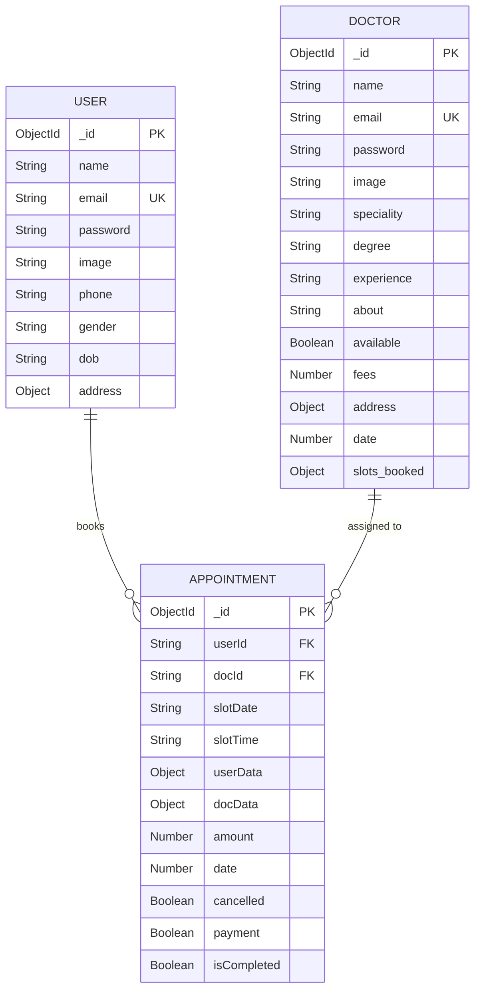

# 🗄️ Database Schema Documentation

This document outlines the entire database architecture for the **Prescripto** Doctor Appointment System. The application uses **MongoDB Atlas** as its cloud database and **Mongoose** as the Object Data Modeling (ODM) library in Node.js.

There are three primary collections in the database:
1. `users` (Patients)
2. `doctors`
3. `appointments`

---

## 📊 Entity Relationship Diagram (ERD)

Below is a Mermaid ER Diagram visualizing how the collections relate to each other.

---

## 📂 Detailed Collection Schemas

### 1. `users` Collection
Stores all patient/user profiles and authentication data.
- **File Location:** `backend/models/userModel.js`

| Field Name | Type | Properties / Default | Description |
|:---|:---|:---|:---|
| `_id` | `ObjectId` | Auto-generated | Unique identifier for the user. |
| `name` | `String` | `required: true` | Full name of the user. |
| `email` | `String` | `required: true, unique: true` | User's email address (used for login). |
| `password` | `String` | `required: true` | Bcrypt hashed password. |
| `image` | `String` | `default: "data:image/svg+xml..."` | Cloudinary URL or default Base64 SVG avatar. |
| `address` | `Object` | `default: { line1: '', line2: '' }`| User's physical address. |
| `gender` | `String` | `default: "Not Selected"` | User's gender. |
| `dob` | `String` | `default: "Not Selected"` | Date of Birth. |
| `phone` | `String` | `default: "0000000000"` | Contact phone number. |

---

### 2. `doctors` Collection
Stores all doctor profiles, specialties, fees, and their availability schedules.
- **File Location:** `backend/models/doctorModel.js`

> [!NOTE]
> This schema uses `{ minimize: false }` to ensure that the `slots_booked` object is saved in the database even if it is completely empty (`{}`).

| Field Name | Type | Properties / Default | Description |
|:---|:---|:---|:---|
| `_id` | `ObjectId` | Auto-generated | Unique identifier for the doctor. |
| `name` | `String` | `required: true` | Full name of the doctor. |
| `email` | `String` | `required: true, unique: true` | Doctor's email address. |
| `password` | `String` | `required: true` | Bcrypt hashed password. |
| `image` | `String` | `required: true` | Cloudinary URL for doctor's portrait. |
| `speciality` | `String` | `required: true` | Medical specialty (e.g., General physician, Dermatologist). |
| `degree` | `String` | `required: true` | Medical qualifications (e.g., MBBS). |
| `experience` | `String` | `required: true` | Years of experience. |
| `about` | `String` | `required: true` | Short bio / description of the doctor. |
| `available` | `Boolean` | `default: true` | Is the doctor currently taking appointments? |
| `fees` | `Number` | `required: true` | Consultation fee amount. |
| `address` | `Object` | `required: true` | Clinic / Hospital address. |
| `date` | `Number` | `required: true` | Timestamp of profile creation. |
| `slots_booked` | `Object` | `default: {}` | A dictionary mapping dates to an array of booked timeslots. |

---

### 3. `appointments` Collection
Stores all the bookings made by users for specific doctors.
- **File Location:** `backend/models/appointmentModel.js`

> [!TIP]
> This collection uses the **Embedded Document** pattern. Instead of using Mongoose `.populate()`, it stores a snapshot of `userData` and `docData` directly in the appointment record at the time of booking. This ensures historical integrity (e.g., if a doctor's fees change later, the old appointment still shows the amount paid).

| Field Name | Type | Properties / Default | Description |
|:---|:---|:---|:---|
| `_id` | `ObjectId` | Auto-generated | Unique identifier for the appointment. |
| `userId` | `String` | `required: true` | References `_id` in `users` collection. |
| `docId` | `String` | `required: true` | References `_id` in `doctors` collection. |
| `slotDate` | `String` | `required: true` | The date of the appointment (e.g., "25_10_2023"). |
| `slotTime` | `String` | `required: true` | The time of the appointment (e.g., "10:30 AM"). |
| `userData` | `Object` | `required: true` | A snapshot of the user's data when booking. |
| `docData` | `Object` | `required: true` | A snapshot of the doctor's data when booking. |
| `amount` | `Number` | `required: true` | The consultation fee at the time of booking. |
| `date` | `Number` | `required: true` | Timestamp of when the appointment was created. |
| `cancelled` | `Boolean` | `default: false` | Whether the appointment was cancelled by user/admin. |
| `payment` | `Boolean` | `default: false` | Whether the Razorpay payment was successful. |
| `isCompleted` | `Boolean` | `default: false` | Whether the doctor has marked the visit as completed. |
