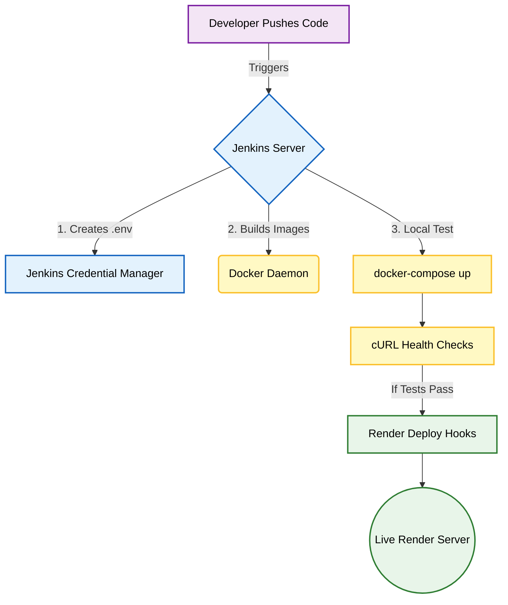
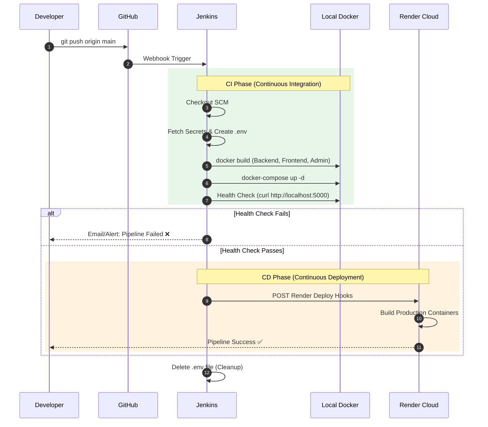

# 🚀 DevOps & CI/CD Pipeline (Docker, Jenkins, Render)

This document breaks down the Continuous Integration and Continuous Deployment (CI/CD) architecture of the **Prescripto** platform. Moving from "it works on my machine" to a fully automated, cloud-hosted deployment is the hallmark of a Senior/Full-Stack engineer.

---

## 🏗️ Deployment Architecture

---

## 📖 How the Pipeline Works (In Plain English)

Here is exactly what happens the millisecond you run `git push` to GitHub:

### Step 1: The Jenkins Checkout
**File:** `Jenkinsfile`
Jenkins (our automation server) detects new code on GitHub. It pulls down the latest code onto the build server.

### Step 2: Injecting Secrets Safely
We have secret API keys (Cloudinary, Razorpay, MongoDB URI) that are *never* stored on GitHub. Jenkins pulls these secrets securely from its internal "Credentials Manager" and uses PowerShell to dynamically create a `.env` file right before building the backend.

### Step 3: Containerization (Docker)
**File:** `docker-compose.yml`
Instead of manually running `npm install` and `npm run dev` for the Frontend, Backend, and Admin, Jenkins tells **Docker** to build three isolated containers. This guarantees that if the app works on the Jenkins server, it will work exactly the same way on Render (eliminating the "it works on my machine" excuse).

### Step 4: Local Health Checks
Before pushing broken code to live users, Jenkins spins up the Docker containers locally and runs automated `curl` tests on ports `5000`, `5173`, and `5174`. If the servers don't respond within 30 seconds, Jenkins **fails the build** and stops the deployment.

### Step 5: Webhook Deployment (Render)
If the local Docker health checks pass, Jenkins fires a HTTP POST request (a Webhook) to **Render.com**. Render receives this signal, clones the code, builds its own production containers, and switches the live traffic to the new version with zero downtime.

---

## 📊 Detailed Pipeline Execution Sequence

---

## 💡 The Ultimate 30 Interview Questions on DevOps & Deployment

### 🟢 Category 1: General CI/CD Concepts
**Q1. What is the difference between Continuous Integration (CI) and Continuous Deployment (CD)?**
> **Answer:** **CI** is the process of automating the merging and testing of code (building the app, running unit tests) every time a developer pushes to Git. **CD** is the process of automatically deploying that tested code to a live production server (like Render) without human intervention.

**Q2. Why do we need a `Jenkinsfile`?**
> **Answer:** It represents "Pipeline-as-Code". Instead of manually clicking buttons in the Jenkins UI to configure a build, the entire deployment workflow is scripted inside the `Jenkinsfile` and version-controlled in Git. If the Jenkins server crashes, we can restore the exact pipeline instantly.

**Q3. What is the difference between a Jenkins `agent any` and a specific agent?**
> **Answer:** `agent any` tells Jenkins to execute the pipeline on any available worker node. In a large enterprise, you might specify `agent { label 'linux' }` or `agent { docker 'node:18' }` to ensure the build runs on a specific OS or inside a specific container.

**Q4. If your build fails, does it break the live application?**
> **Answer:** No! That is the beauty of CI/CD. The pipeline fails at the "Health Check" stage on the Jenkins server *before* the Render Webhooks are ever triggered. The live users remain completely unaffected.

**Q5. Why do you delete the `.env` file in the `always` post-block?**
> **Answer:** Security. If a build fails halfway through, the `.env` file (containing database passwords and API keys) might be left sitting on the Jenkins server's hard drive. The `always` block guarantees it is wiped clean regardless of pipeline success or failure.

### 🔵 Category 2: Docker & Containerization
**Q6. Why did you use Docker for this project?**
> **Answer:** To eliminate environment inconsistencies. My backend requires specific versions of Node.js and MongoDB. Docker packages the app code along with the exact OS, runtime, and dependencies it needs into a standardized "Container" that runs identically everywhere.

**Q7. What is the difference between an Image and a Container?**
> **Answer:** An **Image** is a read-only blueprint (like a class in OOP). A **Container** is a running instance of that image (like an object in OOP). The `docker build` command creates the image, and `docker run` (or docker-compose up) starts the container.

**Q8. What does `docker-compose` do that standard Docker does not?**
> **Answer:** `docker-compose` orchestrates *multiple* containers. Our app has three services (Frontend, Backend, Admin). Instead of running three long `docker run` commands and manually linking networks, `docker-compose.yml` lets us start, stop, and connect all three with a single command (`docker-compose up`).

**Q9. Look at your `docker-compose.yml`. What does `depends_on: - backend` mean?**
> **Answer:** It dictates startup order. It tells Docker not to start the `frontend` or `admin` containers until the `backend` container has started. This prevents the React apps from throwing immediate API connection errors on boot.

**Q10. What does `ports: - "5000:5000"` mean in Docker?**
> **Answer:** It is port forwarding mapping. It maps port `5000` on my host machine to port `5000` inside the isolated Docker container, allowing me to access the backend API from my browser via `localhost:5000`.

### 🟣 Category 3: Jenkins Stages & Scripting
**Q11. How does Jenkins securely access the Razorpay and Cloudinary keys?**
> **Answer:** Through the Jenkins Credentials Binding plugin (`withCredentials`). The keys are securely encrypted in Jenkins' vault. The pipeline temporarily loads them into environment variables (`$env:RAZORPAY_KEY_ID`) exclusively during the `Create Backend .env` stage.

**Q12. You are using `bat` and `powershell` commands in your Jenkinsfile. Why not `sh`?**
> **Answer:** My Jenkins server is running on a Windows host machine. If Jenkins were hosted on a Linux server (which is industry standard), I would replace `bat` and `powershell` with `sh` to execute Bash scripts.

**Q13. Explain the logic inside the "Health Check" stage.**
> **Answer:** It tells Jenkins to wait 30 seconds for the Docker containers to boot, then uses the `curl` command to ping the local ports (5000, 5173, 5174). If the HTTP request fails, `curl` throws an error, which causes the Jenkins shell to exit with a non-zero status, failing the entire pipeline.

**Q14. What happens if the `curl` command hangs indefinitely?**
> **Answer:** I passed the `--max-time 5` flag to `curl`. If the server is frozen and doesn't respond within 5 seconds, `curl` forces a timeout and fails the build, preventing the Jenkins executor from being locked up forever.

**Q15. Why do you run `docker-compose down --remove-orphans` before building?**
> **Answer:** To ensure a clean slate. It stops and deletes the old containers from the previous build so they don't clash on ports (e.g., "Port 5000 is already in use").

### 🟠 Category 4: Webhooks & Cloud Deployment (Render)
**Q16. What is a Webhook?**
> **Answer:** A Webhook is a user-defined HTTP callback. In our pipeline, Jenkins sends an empty POST request to a specific Render URL (`RENDER_BACKEND_HOOK`). This acts as a doorbell, telling Render to wake up, pull the latest code, and start deploying.

**Q17. If Jenkins builds Docker images locally, why do you trigger Render Webhooks? Doesn't Render build it again?**
> **Answer:** Yes, currently Jenkins acts as an automated testing suite. It builds and tests Docker locally to ensure the code *compiles* and *boots*. Once proven safe, the webhook tells Render's PaaS (Platform as a Service) to build and host the live public version.

**Q18. How would you architect this to deploy the *exact* Docker image Jenkins built, instead of making Render build it again?**
> **Answer:** I would modify the Jenkinsfile to push the built Docker images to a registry (like Docker Hub or AWS ECR) using `docker push`. Then, I would configure Render to pull the exact image tag from Docker Hub instead of pulling source code from GitHub.

**Q19. Render spins down free-tier servers after 15 minutes of inactivity. How does this affect your React frontend?**
> **Answer:** The frontend won't spin down because React is compiled into static HTML/CSS/JS and served via a CDN on Render. However, the Node.js backend *will* spin down. The first user to hit the backend after 15 minutes will experience a 30-60 second delay (a "Cold Start").

**Q20. How do you fix "Cold Starts"?**
> **Answer:** Upgrade to a paid Render tier, or set up a free CRON job (e.g., using `cron-job.org`) to ping the backend API `/api/health` every 10 minutes, forcing the server to stay awake.

### 🔴 Category 5: Advanced System Design (Enterprise)
**Q21. How do you handle database migrations during a CI/CD pipeline?**
> **Answer:** In an enterprise app, I would add a stage before the Render deployment that runs an ORM migration tool (like Prisma or Sequelize `db:migrate`). For MongoDB, I might run a custom script to add new fields or indexes to existing documents.

**Q22. If a developer accidentally pushes a bug to `main` and Render deploys it, how do you quickly roll it back?**
> **Answer:** Render supports one-click rollbacks in their dashboard to instantly revert to the previous successful build. Alternatively, the developer can run `git revert <commit_hash>` and push, allowing the CI/CD pipeline to automatically deploy the fix.

**Q23. How do you prevent developers from pushing broken code to the `main` branch in the first place?**
> **Answer:** I would protect the `main` branch in GitHub settings. Developers must create a "Pull Request" (PR). I would configure Jenkins to run a "PR Build" (Unit tests + ESLint) that must pass before GitHub allows the "Merge" button to be clicked.

**Q24. Your pipeline runs unit tests (Health checks). Where do Integration and End-to-End (E2E) tests fit in?**
> **Answer:** E2E tests (using Cypress or Playwright) simulate a real user clicking through a browser. I would add a stage *after* the Docker Health Check to run Cypress against the running `localhost:5173` frontend to test the actual Login and Booking flows.

**Q25. How do you monitor the live Render servers if they crash?**
> **Answer:** I would integrate an APM (Application Performance Monitoring) tool like DataDog, New Relic, or Sentry into the Node.js backend to track uptime, API latency, and log unhandled exceptions.

**Q26. What happens if the `clean up` (always) stage fails to delete the `.env` file?**
> **Answer:** I used `ErrorAction SilentlyContinue` in PowerShell. If the deletion fails (e.g. file is locked by a process), it won't crash the pipeline, but the file remains. In Linux, I would use `rm -f backend/.env || true`. It's a risk that highlights why dedicated secret managers (like AWS Secrets Manager) are better than local `.env` files for enterprise.

**Q27. Can Jenkins be triggered without a GitHub push?**
> **Answer:** Yes, pipelines can be triggered manually in the Jenkins UI, scheduled via CRON syntax to run at midnight every day, or triggered by an external API call to the Jenkins server.

**Q28. Why is it dangerous to hardcode `DOCKER_TAG = "latest"` in your Jenkinsfile?**
> **Answer:** If every build is tagged `latest`, you overwrite the previous image. If a bug is found, you cannot easily rollback to `v1.2` because the image was overwritten. That's why I used `DOCKER_TAG = "${BUILD_NUMBER}"` to ensure every build has a unique, traceable ID.

**Q29. What is the difference between `depends_on` and a Docker Network?**
> **Answer:** `depends_on` only controls the order in which containers boot up. A Docker Network allows the containers to actually talk to each other (e.g., the backend resolving `mongodb://mongo:27017` instead of using `localhost`).

**Q30. Explain what a Blue/Green Deployment is.**
> **Answer:** It's an advanced CD strategy. "Blue" is the live server. When a new deployment happens, it goes to an identical "Green" server. Once Green passes all health checks, the load balancer instantly switches user traffic from Blue to Green, achieving zero-downtime deployment.
