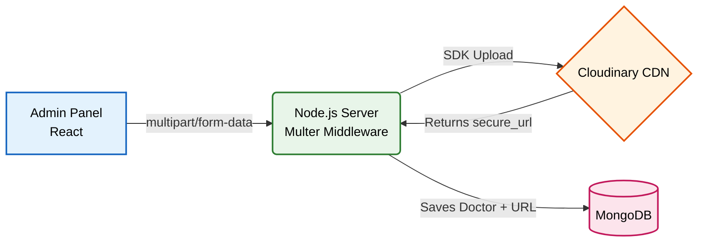
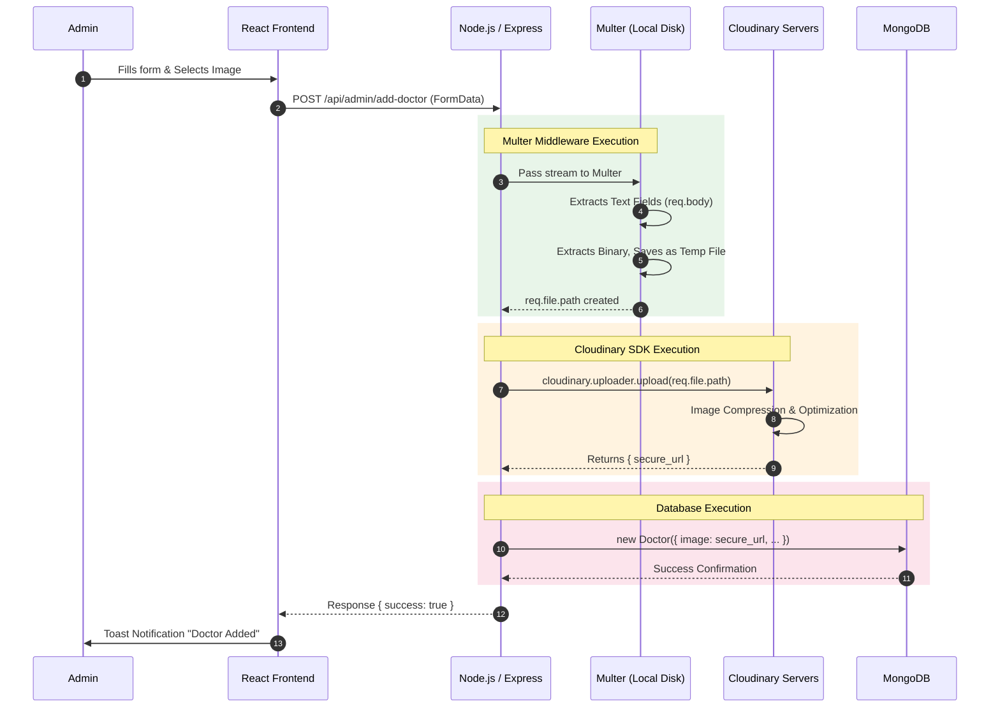
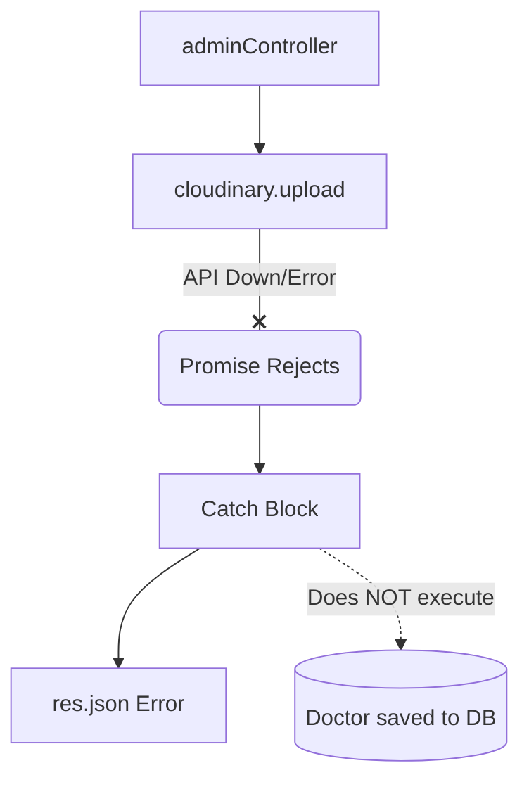

# ☁️ File Uploads & Cloudinary Integration Flow

This document outlines the architecture used to handle image uploads in the **Prescripto** platform (specifically when an Admin adds a new Doctor profile). Uploading files involves dealing with binary data, intermediate storage, and Content Delivery Networks (CDNs)—all highly testable interview topics.

---

## 🏗️ File Upload System Architecture

---

## 📖 How It Works (In Plain English)

Here is the step-by-step story of how an image travels from the Admin's computer to the global internet:

### Step 1: The Admin Uploads a File (Frontend)
The Admin selects a `.jpg` or `.png` file on their computer and fills out the doctor's details. Unlike normal text forms (which send JSON), the frontend wraps the image and the text inside a special format called `multipart/form-data`. It sends this bulky package to the backend.

### Step 2: Multer Intercepts the Package (Backend Middleware)
**File:** `backend/middlewares/multer.js`
Node.js cannot natively understand `multipart/form-data`. So, the request hits a middleware called **Multer** before it reaches our controller. Multer extracts the image file from the request, temporarily saves it to the server's local disk, and attaches the file's information to the `req.file` object.

### Step 3: Pushing to the Cloud (Backend Controller)
**File:** `backend/controllers/adminController.js`
Now inside our `addDoctor` controller, we see the image at `req.file.path`. We do not want to store this image permanently on our server (that would slow it down and fill up the hard drive). Instead, we use the **Cloudinary SDK** to securely send the image to Cloudinary's servers.

### Step 4: Storing the URL (Database)
Cloudinary receives the image, optimizes it, and replies with a `secure_url` (a public HTTPS link to the image). Our backend takes this URL, bundles it with the rest of the doctor's text data (name, fees, address), and saves the entire package into MongoDB.

### Step 5: The CDN Serves the Image (Client-Side)
When a patient visits the website, MongoDB just sends them the Cloudinary string URL. The patient's browser uses that URL to download the image directly from Cloudinary's global Content Delivery Network (CDN), completely bypassing our backend and saving us bandwidth.

---

## 📊 Detailed File Upload Sequence

---

## 💡 The Ultimate 30 Interview Questions on File Uploads

### 🟢 Category 1: Frontend & HTTP Architecture
**Q1. Why can't you send an image inside a standard JSON payload?**
> **Answer:** JSON (JavaScript Object Notation) is a text-based format. Images are binary data. While you *could* convert an image to a massive Base64 text string and put it in JSON, it inflates the file size by 33% and severely blocks the main thread during conversion.

**Q2. What is `multipart/form-data` and why is it used here?**
> **Answer:** It is an encoding type (`enctype`) used in HTTP POST requests specifically designed to send large quantities of binary data (like files) alongside standard text fields, divided into distinct "parts" or boundaries.

**Q3. How do you construct a `multipart/form-data` request in JavaScript/Axios?**
> **Answer:** I use the built-in `FormData` API. `const formData = new FormData(); formData.append('image', imageFile); formData.append('name', name);`, and then pass `formData` as the body in the `axios.post()` call.

**Q4. Does Axios require you to manually set the `Content-Type: multipart/form-data` header?**
> **Answer:** No. When you pass a `FormData` object to Axios, it automatically detects it and sets the correct `Content-Type` header, along with the unique boundary string needed to separate the files.

**Q5. If the admin uploads a 50MB file by accident, how would you stop it on the frontend?**
> **Answer:** Before appending the file to `FormData`, I would check `if (imageFile.size > 5 * 1024 * 1024)` (5MB). If it's larger, I immediately show a toast error and stop the Axios request.

### 🔵 Category 2: Backend Middleware (Multer)
**Q6. What is the purpose of the `multer` package in Node.js?**
> **Answer:** Express does not know how to parse `multipart/form-data` payloads by default. Multer is a middleware that parses the binary data, extracts the files, and attaches them to the `req.file` or `req.files` object for the controller to use.

**Q7. What is the difference between Multer's `diskStorage` and `memoryStorage`?**
> **Answer:** `diskStorage` temporarily saves the incoming file to the server's hard drive (which is what I used via `req.file.path`). `memoryStorage` keeps the file as a raw Buffer in the server's RAM.

**Q8. Why didn't you use `memoryStorage`?**
> **Answer:** If multiple admins upload large files simultaneously, storing them all in RAM (`memoryStorage`) could quickly crash the Node server due to out-of-memory errors. `diskStorage` is safer for the server's RAM.

**Q9. Explain `upload.single('image')` in your router file.**
> **Answer:** This tells Multer to look specifically for a single file uploaded under the field name `'image'`. It parses that specific file and ignores others, attaching it to `req.file`.

**Q10. How does the backend receive the text fields (name, email) if the payload is `multipart/form-data`?**
> **Answer:** Multer handles this automatically. It separates the binary file into `req.file` and parses all the standard text fields into the standard `req.body` object.

**Q11. Draw a diagram of how Multer processes the incoming request.**
> **Answer:**

### 🟣 Category 3: Cloudinary & CDN Concepts
**Q12. Why don't you just save the images in your MongoDB database?**
> **Answer:** MongoDB is designed for fast text/document querying, not storing large binary blobs. Storing images in MongoDB inflates the database size, slows down backups, and drastically reduces query performance. (Also, MongoDB documents have a strict 16MB limit).

**Q13. Why don't you permanently save the images on your Node server's hard drive?**
> **Answer:** Two reasons: 
> 1. **Scalability:** If we scale to 3 Node servers behind a load balancer, an image saved on Server A won't be visible to users hitting Server B.
> 2. **Performance:** Serving static images takes up server bandwidth and CPU cycles that should be reserved for API logic.

**Q14. What is Cloudinary and what role does it play here?**
> **Answer:** Cloudinary is a cloud-based image and video management service. It acts as our storage bucket and automatically optimizes, resizes, and serves the images via a CDN.

**Q15. What is a CDN (Content Delivery Network)?**
> **Answer:** A network of servers distributed globally. When Cloudinary gives us a URL, and a patient in India requests that URL, the image is downloaded from a server located in India, not from a centralized server in the US. This massively reduces load times.

**Q16. How do you authenticate with Cloudinary in your backend?**
> **Answer:** I created a `connectCloudinary.js` config file that calls `cloudinary.config()` using my `CLOUDINARY_NAME`, `CLOUDINARY_API_KEY`, and `CLOUDINARY_SECRET_KEY` stored in my `.env` variables.

**Q17. What exactly does `cloudinary.uploader.upload` return?**
> **Answer:** A large JSON object containing metadata about the uploaded file. The most important property is `secure_url`, which is the public HTTPS link to the image.

**Q18. What is the difference between `url` and `secure_url` in the Cloudinary response?**
> **Answer:** `url` is standard HTTP. `secure_url` uses HTTPS. We must always save the `secure_url` to the database to prevent browser "Mixed Content" security warnings.

### 🟠 Category 4: Security & Edge Cases
**Q19. What happens if the admin forgets to attach an image?**
> **Answer:** `req.file` will be undefined. I have an early-return check `if (!imageFile) { return res.json({ message: "Image not uploaded" }) }` to prevent the app from crashing when it tries to read `imageFile.path`.

**Q20. How would you prevent an admin from uploading a malicious `.exe` or `.pdf` file instead of an image?**
> **Answer:** I would add a `fileFilter` function inside the Multer config to check the file's mimetype (`if (file.mimetype === 'image/jpeg' || file.mimetype === 'image/png')`). If it fails, Multer rejects the upload before it even saves to disk.

**Q21. If Cloudinary's API goes down, what happens to your `addDoctor` function?**
> **Answer:** The `cloudinary.uploader.upload` promise will reject. The `catch (error)` block will catch it, and return a `success: false` JSON response. The database will NOT save a new doctor without an image.

**Q22. Draw a diagram of what happens if Cloudinary fails during the upload process.**
> **Answer:**

**Q23. In your current code, what happens to the temporary file saved by Multer after it is uploaded to Cloudinary?**
> **Answer:** Currently, it just sits on the server's hard drive! This is a memory leak over time. In a strict production app, I would import Node's `fs` (File System) module and run `fs.unlinkSync(imageFile.path)` to delete the temporary file after Cloudinary successfully returns the URL.

**Q24. If a hacker inspects the React frontend network tab, can they find your Cloudinary API Secret?**
> **Answer:** No. The Cloudinary upload happens entirely on the backend Node.js server. The frontend only communicates with my backend, keeping the third-party API secrets safe on the server.

### 🔴 Category 5: Database & Architecture (Advanced)
**Q25. If an admin deletes a doctor from the MongoDB database, what happens to the image on Cloudinary?**
> **Answer:** Currently, it remains on Cloudinary forever (creating an orphaned file and wasting storage space). To fix this, when deleting a doctor, I would extract the Cloudinary `public_id` from the URL and call `cloudinary.uploader.destroy(public_id)` to delete the image from the cloud.

**Q26. Why do you hash the password (`bcrypt.hash`) BEFORE uploading the image to Cloudinary?**
> **Answer:** Optimization and cost-saving. Hashing takes milliseconds. Uploading an image takes several seconds. If the password hashing fails for some reason, the function errors out *before* we make an expensive, time-consuming API call to Cloudinary.

**Q27. How do you handle address data in the `multipart/form-data` payload?**
> **Answer:** Because `FormData` only sends flat strings, an object like `{ line1: "123 St" }` is stringified. On the backend, I must explicitly use `JSON.parse(address)` before saving it to the Mongoose schema.

**Q28. What happens if the Mongoose database crashes exactly AFTER the Cloudinary upload finishes?**
> **Answer:** The image is successfully hosted on Cloudinary, but the doctor is not saved in our database. This creates an orphaned file. A solution is to put `cloudinary.uploader.destroy()` inside the `catch` block if the error was a Mongoose error.

**Q29. How does uploading files impact your Serverless deployment (e.g., if deployed on Vercel instead of Render)?**
> **Answer:** Serverless functions (like AWS Lambda/Vercel) have read-only file systems and very strict payload size limits (usually 4MB). Multer's `diskStorage` would fail completely. We would have to use `memoryStorage` or implement Direct-to-Cloud uploads.

**Q30. What is a "Direct-to-Cloud" upload and why is it better?**
> **Answer:** Instead of sending the image to our Node backend (Frontend -> Backend -> Cloudinary), the backend generates a secure, temporary "signature". The frontend uses this signature to upload the image directly to Cloudinary (Frontend -> Cloudinary). This bypasses our backend entirely, saving massive amounts of server bandwidth and CPU.
