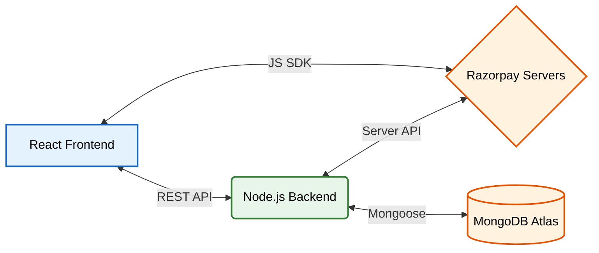
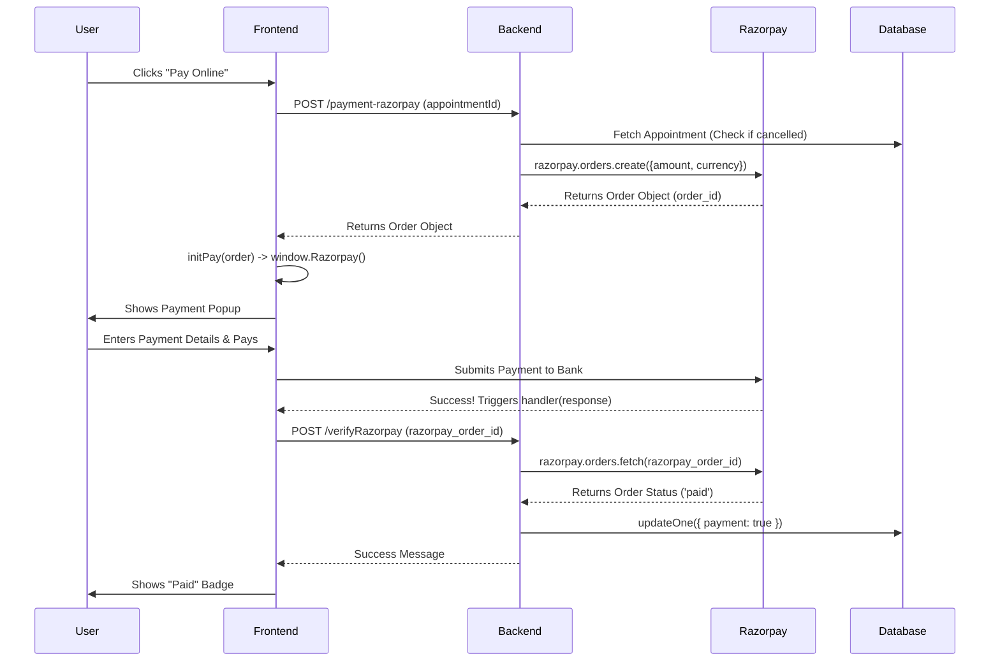
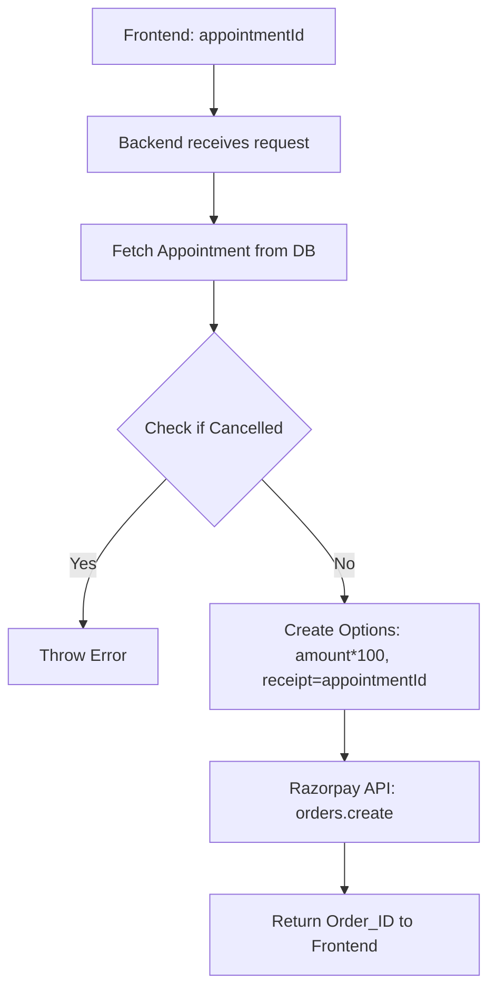

# 💳 The Payment Gateway Flow (Razorpay)

This document explains the end-to-end integration of the Razorpay payment gateway in the **Prescripto** platform. Integrating a third-party payment provider is a complex task that interviewers love to ask about. This guide covers how we generate orders, handle the client-side SDK, verify payments, and handle edge cases.

---

## 📖 How It Works (In Plain English)

Here is the step-by-step story of how a patient pays for their appointment:

### Step 1: The User Clicks "Pay Online"
**File:** `frontend/src/pages/MyAppointments.jsx`
When the user clicks "Pay Online", the frontend immediately calls the backend with the `appointmentId`. It doesn't ask the user for their credit card yet; it first needs permission from the server to start a transaction.

### Step 2: The Server Creates an "Order"
**File:** `backend/controllers/userController.js` (Function: `paymentRazorPay`)
The backend checks if the appointment exists and isn't cancelled. If everything is fine, it securely contacts Razorpay using our secret API keys. It tells Razorpay: *"Hey, I need to charge this user X amount of money."* Razorpay replies with an official `Order ID`. The backend sends this `Order ID` back to the frontend.

### Step 3: The Razorpay UI Opens
**File:** `frontend/src/pages/MyAppointments.jsx` (Function: `initPay`)
The frontend receives the `Order ID` and uses the Razorpay JavaScript SDK (`window.Razorpay`) to open the famous Razorpay payment popup. The user enters their card/UPI details and pays.

### Step 4: The Payment Succeeds
**File:** Razorpay SDK -> `frontend/src/pages/MyAppointments.jsx` (Handler)
Once the bank approves the payment, Razorpay closes the popup and triggers a "Success Handler" function in our React code. Razorpay hands the frontend a "Payment Receipt" (specifically, a `razorpay_payment_id` and a `razorpay_order_id`).

### Step 5: The Server Verifies the Payment
**File:** `backend/controllers/userController.js` (Function: `verifyRazorpay`)
The frontend sends the receipt to the backend. **The backend does not trust the frontend.** It takes the `Order ID` from the receipt, securely asks the Razorpay API *"Is this order actually paid?"*, and if Razorpay confirms it, the backend updates the database (`payment: true`) and the user's screen updates to show a "Paid" badge!

---

## 🏗️ System Architecture Overview

Before looking at the step-by-step sequence, here is how the 4 main components talk to each other:



---

## 📊 Payment Procedure Sequence



---

## 💡 The Ultimate 36 Interview Questions on Payments

If you claim to have integrated Razorpay on your resume, interviewers will drill you on security and edge cases. Here are 36 questions to prepare you.

### 🟢 Category 1: Razorpay Architecture & Basics
**Q1. Why do we need a backend for Razorpay? Why can't the React frontend just process the payment directly?**
> **Answer:** Security. To create an order or verify a payment, you need the `RAZORPAY_KEY_SECRET`. If you put this secret in your React code, anyone can inspect the browser, steal your secret key, and manipulate payments or steal your funds.

**Q2. What is the difference between an "Order" and a "Payment" in Razorpay?**
> **Answer:** An **Order** is an intention to collect money (created by the backend before the user pays). A **Payment** is the actual transaction where money leaves the user's bank. One Order can have multiple attempted Payments (if the first card fails, the user tries a second card on the same Order).

**Q3. How do you load the Razorpay SDK into your React app?**
> **Answer:** By adding the script tag `<script src="https://checkout.razorpay.com/v1/checkout.js"></script>` in the `index.html` file, which attaches the `Razorpay` constructor to the global `window` object.

**Q4. What is the `RAZORPAY_KEY_ID` and is it safe to expose it in the frontend?**
> **Answer:** The Key ID is a public identifier for your Razorpay merchant account. Yes, it is perfectly safe to expose it in the React frontend (using `import.meta.env.VITE_RAZORPAY_KEY_ID`) because it cannot be used to execute API calls without the Secret Key.

**Q5. Why do we multiply the amount by 100 in the backend when creating the order?**
> **Answer:** Razorpay (and Stripe) expect the `amount` to be in the smallest currency sub-unit to avoid floating-point decimal errors. For INR, this means paise. So ₹500 is sent as `50000` paise.

**Q6. What is the `receipt` field used for when creating an order?**
> **Answer:** The `receipt` is an optional, internal reference ID. In this project, I pass the `appointmentId` as the receipt. This makes it easy to map the Razorpay order back to the specific MongoDB appointment later.

**Q7. Does Razorpay automatically capture payments, or do you have to do it manually?**
> **Answer:** Razorpay defaults to automatically capturing payments. Once the bank authenticates the transaction, the money is captured and sent to the merchant account.

### 🔵 Category 2: Frontend & SDK Integration
**Q8. Explain the `options` object passed to `new window.Razorpay(options)`.**
> **Answer:** It contains the `key` (public key), the `amount`, the `currency`, the `name` of our clinic, the backend-generated `order_id`, and most importantly, the `handler` callback function which Razorpay triggers upon successful payment.

**Q9. What does the `handler` function do?**
> **Answer:** It is a callback that fires automatically when the payment is successful. It receives a `response` object containing the `razorpay_payment_id`, `razorpay_order_id`, and `razorpay_signature`.

**Q10. What happens if the user clicks the "Close" (X) button on the Razorpay popup before paying?**
> **Answer:** The popup closes. You can optionally define a `modal: { ondismiss: function() {} }` property in the `options` object to catch this event and show a toast saying "Payment Cancelled by User".

**Q11. Why do you fetch the appointments again (`getUserAppointments()`) after the handler succeeds?**
> **Answer:** To sync the UI with the database. The database now marks the appointment as `payment: true`. Fetching the data again ensures the "Pay Online" button disappears and the "Paid" badge appears.

**Q12. How do you handle network errors if the `window.Razorpay` script fails to load?**
> **Answer:** You should check `if (!window.Razorpay)` before calling it. If it doesn't exist, display an alert telling the user to check their internet connection or disable their ad-blocker.

**Q13. Why use `axios.post` instead of a simple `<form action="/pay">`?**
> **Answer:** Because this is a Single Page Application (SPA). We want to create the order asynchronously in the background and pop open the modal without refreshing the browser page.

**Q14. How does Razorpay know what theme colors to use for the popup?**
> **Answer:** You can pass a `theme: { color: "#5f6FFF" }` property inside the `options` object to match the popup's header color to your website's primary brand color.

### 🟣 Category 3: Backend & Order Creation

**Diagram: The Order Creation Process**


**Q15. Walk me through the backend `paymentRazorPay` API.**
> **Answer:** It receives the `appointmentId`. It queries the DB to ensure the appointment exists and isn't already cancelled. It creates an `options` object with the amount in paise. It calls `razorpayInstance.orders.create(options)` and returns the resulting order object to the frontend.

**Q16. Why do you check `if (appointmentData.cancelled)` before creating an order?**
> **Answer:** Business logic safety. If a user cancels an appointment in one tab, but tries to pay for it in another tab, we must stop them from paying for a cancelled service.

**Q17. How do you initialize the Razorpay instance in the backend?**
> **Answer:** I import the `razorpay` NPM package and create a new instance by passing an object containing my `key_id` and `key_secret` from my `.env` file.

**Q18. What happens if Razorpay's API is down when `orders.create` is called?**
> **Answer:** The `orders.create` promise will reject. My `try/catch` block will catch the error, and `res.json({success: false, message: error.message})` will be sent back to the frontend, which displays a toast error.

**Q19. Is the `appointmentData.amount` securely pulled from the DB, or did the frontend send it?**
> **Answer:** It is pulled directly from the database (`appointmentData.amount`). **Never** trust the frontend to send the price. A malicious user could alter the API request and send `amount: 1` to pay ₹1 for a ₹500 appointment.

**Q20. What is the difference between `razorpay_order_id` and `appointmentId`?**
> **Answer:** `appointmentId` is our MongoDB primary key (`_id`). `razorpay_order_id` is Razorpay's unique identifier (starts with `order_...`) for this specific financial transaction intent.

**Q21. Why do we store the secret keys in a `.env` file?**
> **Answer:** To prevent them from being committed to GitHub. If a secret key is exposed on a public repo, bots will scrape it and malicious actors can issue refunds or transfer money out of your account.

### 🟠 Category 4: Payment Verification & Security
**Q22. Explain how the `verifyRazorpay` API works.**
> **Answer:** It receives the `razorpay_order_id` from the frontend. It uses the SDK to explicitly fetch the order details from Razorpay's servers (`orders.fetch()`). If Razorpay says the status is `paid`, we update the MongoDB appointment to `payment: true`.

**Q23. Standard Razorpay integration verifies a cryptographic signature (HMAC SHA256). Your code fetches the order status directly from Razorpay API. What is the difference?**
> **Answer:** Both are secure! The cryptographic method (using `crypto` to hash the order ID and payment ID with the secret key) is faster because it requires zero API calls. My method makes an API call back to Razorpay to ask for the status. Both definitively prove the payment is legitimate.

**Q24. Why is verification even necessary? Why not just update the DB when the frontend says "success"?**
> **Answer:** Because the frontend is easily hackable. A user can open Chrome DevTools, intercept the network, and send a fake request to the backend saying `{ success: true }` without ever opening Razorpay. The backend must independently verify with Razorpay.

**Q25. How do you know which appointment to update after verifying the payment?**
> **Answer:** When creating the order, I passed the `appointmentId` into the `receipt` field. When I fetch the order from Razorpay during verification, `orderInfo.receipt` contains the exact `appointmentId` I need to update in MongoDB.

**Q26. What happens if the `orders.fetch` returns a status of `created` or `attempted` instead of `paid`?**
> **Answer:** The code executes the `else` block, logging an error and returning `{success: false, message: "Payment failed"}`. The database is NOT updated.

**Q27. Draw a diagram showing how a hacker might try to bypass payments, and how your verification stops them.**
> **Answer:**
```mermaid
graph TD
    A[Hacker] -->|Fake Success API Call| B(Backend)
    B -->|orders.fetch(fake_id)| C{Razorpay API}
    C -->|Error: Invalid Order| D[Backend Blocks Hack]
    D --> E((Database remains unpaid))
```

**Q28. If the payment fails on the Razorpay modal (e.g. Insufficient Funds), does the `handler` function run?**
> **Answer:** No. Razorpay handles failures internally within the modal, prompting the user to try another card. The `handler` only runs on a definitive success.

**Q29. What is a Webhook, and why might you need one for payments in the future?**
> **Answer:** If the user pays successfully on their phone, but loses internet connection before the frontend can call `/verifyRazorpay`, the DB will never update! A Webhook is an endpoint where Razorpay securely POSTs a message directly to your backend the millisecond the bank confirms the payment, bypassing the frontend entirely.
>
> **Diagram: Frontend Verification vs Webhook Verification**
> ```mermaid
> graph LR
>    subgraph Current Approach (Frontend Dependent)
>    A[Razorpay] -->|Success Event| B[Frontend]
>    B -->|API Call| C[Backend DB Update]
>    end
>    subgraph Webhook Approach (Fail-Safe)
>    D[Razorpay] -.->|Direct Server POST| E[Backend DB Update]
>    end
> ```

### 🔴 Category 5: System Design & Edge Cases (Advanced)
**Q30. Design Question: How do you handle "Double Charges" where a user clicks "Pay" twice rapidly?**
> **Answer:** The frontend should disable the "Pay" button and show a loading spinner immediately after clicking. On the backend, we should ensure idempotency—if the appointment already has `payment: true`, the API should reject any new order creations.

**Q31. How do you handle refunds if a doctor cancels the appointment after the user paid?**
> **Answer:** I would create a new backend route that calls `razorpayInstance.payments.refund()`, passing the stored payment ID. Then, update the DB to reflect `payment: refunded`.

**Q32. If Razorpay's API goes down completely, how does your system handle it?**
> **Answer:** The backend API calls will fail, and our `catch` blocks will return standard error messages. The UI will gracefully show an error toast. Users won't be able to pay, but the rest of the application (viewing profiles, booking unpaid slots) will remain fully functional.

**Q33. What database transaction anomalies could happen during payment verification?**
> **Answer:** If we verify the payment with Razorpay, but our MongoDB database crashes exactly as we call `findByIdAndUpdate`, the user is charged but our DB says unpaid. 

**Q34. How would you solve the anomaly mentioned in Q33?**
> **Answer:** We need an async queue (like RabbitMQ) or a CRON job. The CRON job scans the database every 10 minutes for unpaid appointments, explicitly queries Razorpay for their status, and reconciles the database if it finds a discrepancy.

**Q35. Can a user share their payment link with someone else?**
> **Answer:** Razorpay supports "Payment Links", but our integration uses the Checkout Modal tied to the logged-in user's session. They cannot share a link because the backend validates their JWT token before creating the order.

**Q36. How would you handle international patients trying to pay in USD?**
> **Answer:** I would check the user's location. When calling `orders.create`, I would change `currency: process.env.CURRENCY` (INR) to `USD`, and use an API to dynamically convert the doctor's INR fee to USD before multiplying by 100 (cents).
