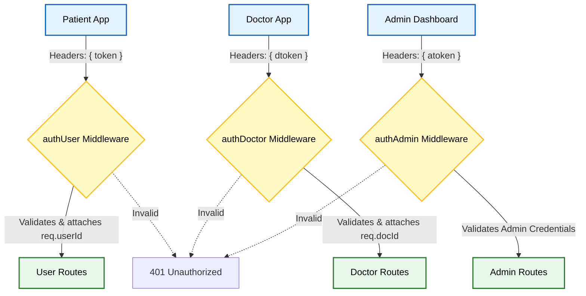
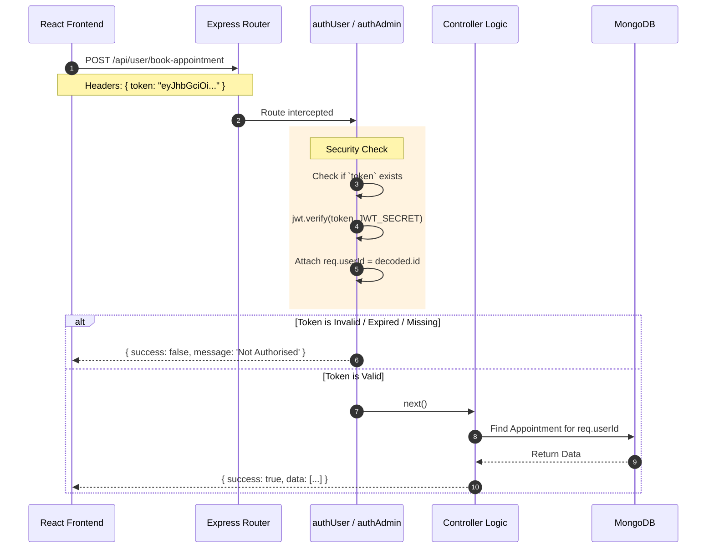

# 🛡️ Role-Based Access Control (RBAC) & Security Flow

This document details the authentication and authorization architecture of the **Prescripto** platform. The system supports three distinct user roles: **Patients**, **Doctors**, and **Admins**. Implementing a multi-role system is a core requirement for enterprise applications and a frequent topic in system design interviews.

---

## 🏗️ RBAC System Architecture

Before looking at the code, here is how the three roles are separated at the network layer:

---

## 📖 How It Works (In Plain English)

Here is exactly how the backend knows who you are and what you are allowed to do:

### Step 1: The Three Header Strategy
Instead of using a single `Authorization: Bearer <token>` header for everyone, this project uses a strict separation of concerns by looking for three completely different header keys based on the frontend client making the request:
- Patients send their JWT in `headers.token`
- Doctors send their JWT in `headers.dtoken`
- Admins send their JWT in `headers.atoken`

### Step 2: The Three Middlewares
**Files:** `backend/middlewares/authUser.js`, `authDoctor.js`, `authAdmin.js`
When a request hits an API route (e.g., `/api/admin/add-doctor`), it must pass through a "Middleware Bouncer" before reaching the controller.
- The `authAdmin` bouncer checks if `atoken` exists.
- It uses `jwt.verify` and the `JWT_SECRET` to decode the token.
- If it fails, or if it was a Patient trying to use their `token` on an Admin route, the middleware blocks the request and returns `Not Authorised`.

### Step 3: Payload Verification (The Admin Secret)
**File:** `backend/middlewares/authAdmin.js`
Patient and Doctor JWTs contain their MongoDB `_id` as the payload. However, the Admin is hardcoded. When the Admin logs in, the backend creates a JWT out of the literal string `ADMIN_EMAIL + ADMIN_PASSWORD`. When `authAdmin` decodes the token, it strictly checks if the decoded string matches the environment variables exactly.

### Step 4: Context Injection
**File:** `backend/middlewares/authUser.js` & `authDoctor.js`
If the token is valid, the middleware grabs the MongoDB `_id` from the decoded token and forcefully attaches it to the request object (`req.userId = token_decode.id`). This ensures that when the controller executes, it fetches data for the *authenticated* user, preventing a hacker from sending a fake `userId` in the body.

---

## 📊 Authentication Sequence Flow

---

## 💡 The Ultimate 30 Interview Questions on RBAC & Security

### 🟢 Category 1: JWT & Middleware Basics
**Q1. What is a Middleware in Node.js?**
> **Answer:** Middleware is a function that has access to the request object (`req`), the response object (`res`), and the `next` function. It executes *between* the raw incoming request and the final controller logic, usually used for validation, logging, or authentication.

**Q2. What does the `next()` function do in your `authAdmin` file?**
> **Answer:** If the token is successfully verified, calling `next()` tells Express to exit the middleware and pass control to the next function in the route chain (which is the actual controller function like `addDoctor`).

**Q3. If you forget to call `next()`, what happens?**
> **Answer:** The request will hang indefinitely. The client's browser will spin until it eventually times out, because the server neither sent a response (`res.json()`) nor passed it to the controller.

**Q4. What is a JWT (JSON Web Token)?**
> **Answer:** A JWT is a stateless, cryptographically signed string that securely transmits information between the client and server. It consists of three parts: Header (algorithm type), Payload (user data), and Signature (to prevent tampering).

**Q5. Can a hacker decode a JWT to read the data inside it?**
> **Answer:** Yes! JWT payloads are just Base64 encoded, not encrypted. Anyone can paste a JWT into `jwt.io` and read the payload. That is why you should *never* put passwords or credit cards inside a JWT payload—only public identifiers like user IDs.

### 🔵 Category 2: The Tri-Token Architecture
**Q6. You used `token`, `atoken`, and `dtoken` in your headers. What is the advantage of this?**
> **Answer:** It prevents "Cross-Role Contamination". If an Admin accidentally logs into the Patient portal, the frontend won't be able to use the `atoken` to access Patient API routes, because `authUser` specifically looks for `req.headers.token`.

**Q7. Most companies use a single `Authorization: Bearer <token>` header. How would you refactor your code to do that?**
> **Answer:** I would combine all three login routes to issue a single token with a role attached to the payload (e.g., `{ id: user._id, role: 'ADMIN' }`). Then, I would create one middleware `authMiddleware(allowedRoles)` that checks if `req.user.role` is inside the `allowedRoles` array.

**Q8. How does the `authAdmin` middleware verify the admin?**
> **Answer:** Unlike the user middleware which decodes a JSON object, the admin token was signed using a literal concatenated string: `email + password`. The middleware decodes the string and checks `if (token_decode !== process.env.ADMIN_EMAIL + process.env.ADMIN_PASSWORD)`. 

**Q9. Is it secure to use environment variables (`ADMIN_EMAIL`) for admin authentication instead of a database?**
> **Answer:** Yes, for a single "Super Admin" scenario, it is highly secure because environment variables cannot be accessed via a database SQL injection. However, it doesn't scale if you need multiple admins with different permissions.

**Q10. Why is the `JWT_SECRET` so important?**
> **Answer:** The secret key is used to generate the cryptographic signature. If a hacker discovers your `JWT_SECRET`, they can mint their own fake JWTs with `{ id: "admin_id" }` and completely take over the platform without needing a password.

### 🟣 Category 3: Context Injection & Security
**Q11. In `authUser`, you do `req.userId = token_decode.id`. Why?**
> **Answer:** This is called Context Injection. It allows the subsequent controller to know exactly who made the request without relying on the client to send their `userId` in the body.

**Q12. What would happen if you didn't use `req.userId` and instead let the frontend send `{ userId: "123" }` in the POST body?**
> **Answer:** Massive security flaw (Insecure Direct Object Reference - IDOR). A hacker could log in as Patient A, get a valid token, but change the POST body to `{ userId: "Patient_B_ID" }` and successfully book or cancel appointments on behalf of Patient B.

**Q13. How do you handle token expiration in your app?**
> **Answer:** Currently, the tokens do not have an expiration time defined in `jwt.sign()`. In a production environment, I would pass `{ expiresIn: '1h' }` to force the user to re-authenticate or use a Refresh Token.

**Q14. If a token is stolen, how can you invalidate it if JWTs are stateless?**
> **Answer:** Stateless JWTs cannot be natively revoked. To fix this, I would implement a "Token Blacklist" in a fast Redis database, or add a `tokenVersion` integer to the MongoDB user schema. If the token version doesn't match the DB, it's rejected.

**Q15. Why use `jwt.verify` inside a `try/catch` block?**
> **Answer:** If a token is malformed, tampered with, or expired, `jwt.verify()` does not return `false`—it synchronously throws an error. The `catch` block intercepts this and gracefully returns a `success: false` response instead of crashing the Node server.

### 🟠 Category 4: Frontend Routing & Protection
**Q16. How do you protect Admin routes on the React frontend?**
> **Answer:** Using React Context. If `aToken` is empty or null, I conditionally render a Login screen. If it exists, I render the Admin Dashboard layout.

**Q17. Is frontend route protection secure enough?**
> **Answer:** Absolutely not. Frontend protection is purely for User Experience (UX) to hide buttons they can't click. A hacker can easily bypass React state using Chrome DevTools. True security *only* happens on the backend API middlewares.

**Q18. Where do you store the JWT on the frontend?**
> **Answer:** In `localStorage`. This makes it persistent across browser refreshes.

**Q19. What is the danger of storing JWTs in `localStorage`?**
> **Answer:** Cross-Site Scripting (XSS). If a hacker injects malicious JavaScript into the app (e.g., via a compromised NPM package), that script can run `localStorage.getItem('token')` and steal the token.

**Q20. What is a safer alternative to `localStorage`?**
> **Answer:** `HttpOnly` Cookies. By sending the JWT inside an `HttpOnly` cookie, the browser automatically attaches it to every backend request, but JavaScript (`document.cookie`) cannot read it, completely neutralizing XSS token theft.

### 🔴 Category 5: Advanced System Design
**Q21. Imagine the hospital hires 50 receptionists. They need access to view appointments but shouldn't be able to add Doctors. How do you architect this?**
> **Answer:** I would migrate from hardcoded `.env` admins to an `Admin` MongoDB collection with a `role` enum (`SUPER_ADMIN`, `RECEPTIONIST`). The middleware would check the DB for their specific permissions before calling `next()`.

**Q22. What is a CSRF attack and are you vulnerable to it?**
> **Answer:** Cross-Site Request Forgery (CSRF) is when a malicious site tricks a user's browser into making an API call to your backend. Because I use `localStorage` and custom headers (`token`), I am largely immune. CSRF mainly targets applications using automatic cookie authentication.

**Q23. Why do you use `select('-password')` when fetching the Doctor profile?**
> **Answer:** To prevent the hashed password from ever leaving the database and traveling over the network. Even though it is hashed, exposing it is a security risk (susceptible to offline brute-force/Rainbow Table attacks).

**Q24. If an Admin is fired, how quickly can you revoke their access in your current architecture?**
> **Answer:** I would have to change the `ADMIN_PASSWORD` in the `.env` file and restart the Node.js server. The `authAdmin` middleware dynamically checks against the `.env` variable, so their old JWT (which contains the old password) would instantly fail `jwt.verify`.

**Q25. What is the difference between Authentication and Authorization?**
> **Answer:** **Authentication** is verifying *who* you are (checking the password/JWT). **Authorization** is verifying *what* you are allowed to do (checking if a Patient is allowed to access an Admin route).

**Q26. How do you prevent Brute Force login attacks?**
> **Answer:** I would implement `express-rate-limit` on the `/login` routes, restricting users to 5 login attempts per 15 minutes to stop automated bots from guessing passwords.

**Q27. Can a Doctor cancel an appointment that belongs to another Doctor?**
> **Answer:** Only if the backend lacks proper authorization checks. In the `cancelAppointment` controller, I must always ensure that the `appointment.docId` matches the `req.docId` injected by the middleware.

**Q28. Why does `jwt.sign()` require a secret key but `jwt.decode()` does not?**
> **Answer:** `jwt.decode()` only decodes the Base64 payload (which is public). `jwt.verify()` (which uses the secret) actually recalculates the cryptographic signature to prove the token hasn't been tampered with since it was signed.

**Q29. What happens if you deploy your backend to multiple Render instances (Load Balancing)?**
> **Answer:** Because JWTs are completely stateless, it works perfectly! The server doesn't need to remember who is logged in. Any instance can verify the token using the shared `JWT_SECRET` environment variable.

**Q30. If you were to audit this application for production readiness, what is the #1 security flaw you would fix?**
> **Answer:** The lack of Token Expiration. I would add an `expiresIn` property to all JWTs and implement a Refresh Token rotation strategy. Currently, if a token is stolen from `localStorage`, the hacker has permanent access until the `JWT_SECRET` is rotated.
