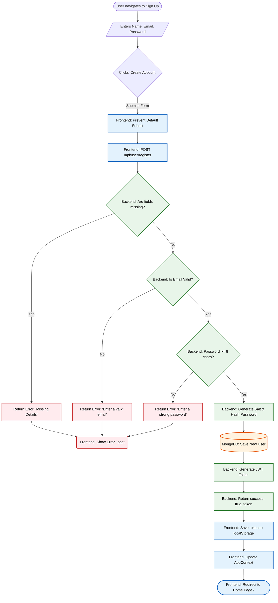
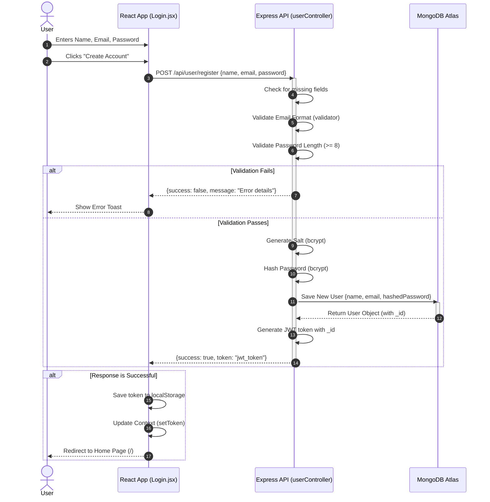

# 📝 Patient Registration Flow

This document explains the complete, end-to-end process of what happens when a new patient creates an account on the **Prescripto** platform.

## 🔄 The Complete Procedure

### 1. Frontend: User Input
**File:** `frontend/src/pages/Login.jsx`
- The user navigates to the login page and selects the **"Sign Up"** option.
- They fill out a form with their **Full Name**, **Email**, and **Password**.
- Clicking "Create Account" triggers the `onSubmitHandler` function.
- The default browser form submission is prevented (`event.preventDefault()`).

### 2. Frontend: API Request
**File:** `frontend/src/pages/Login.jsx`
- The frontend sends an HTTP `POST` request using `axios` to the backend endpoint `[backendUrl]/api/user/register`.
- The request body contains the user's data: `{ name, email, password }`.

### 3. Backend: Route & Controller
**Route File:** `backend/routes/userRoute.js` (Maps `/register` to the controller)
**Controller File:** `backend/controllers/userController.js` (Function: `registerUser`)
- The request is routed to the `registerUser` function.
- **Validation Steps:**
  - **Missing Data:** Checks if `name`, `email`, and `password` are provided.
  - **Email Format:** Validates the email using the `validator` package (`validator.isEmail()`).
  - **Password Strength:** Ensures the password is at least 8 characters long.
- If any validation fails, the backend immediately returns a response like `{ success: false, message: "Error message" }`.

### 4. Backend: Password Security
**File:** `backend/controllers/userController.js`
- The backend generates a secure salt with a cost factor of 10 (`bcrypt.genSalt(10)`).
- The plain-text password is mathematically hashed using this salt (`bcrypt.hash(password, salt)`).

### 5. Backend: Database Storage
**Model File:** `backend/models/userModel.js`
**Controller File:** `backend/controllers/userController.js`
- A new user object is constructed with the `name`, `email`, and the **hashed password**.
- This object is saved as a new document in the MongoDB Atlas database (`newUser.save()`).

### 6. Backend: Authentication Token
**File:** `backend/controllers/userController.js`
- A JSON Web Token (JWT) is generated using `jwt.sign()`.
- The payload of the token contains the newly created user's unique database ID (`{ id: user._id }`).
- The token is signed securely using the `JWT_SECRET` environment variable.
- The backend sends a successful response back to the frontend: `{ success: true, token: "..." }`.

### 7. Frontend: Completing the Flow
**Component File:** `frontend/src/pages/Login.jsx`
**Context File:** `frontend/src/context/AppContext.jsx`
- The frontend receives the response in the `onSubmitHandler`.
- If `success` is true, the `token` is saved to the browser's `localStorage` to keep the user logged in across page reloads.
- The application's global state is updated with the new token (`setToken(data.token)`).
- A `useEffect` hook detects that the token is now set and automatically redirects (`navigate('/')`) the user to the home page.
- If there was an error during the process, a popup notification (`toast.error()`) displays the error message to the user.

---

## 📊 Process Flowchart

Below is a detailed Mermaid flowchart visualizing the step-by-step registration process. It highlights the Frontend, Backend, and Database layers.

---

## 🔄 Sequence Diagram

Below is a detailed Mermaid sequence diagram visualizing the registration flow across the different layers of the application over time.

