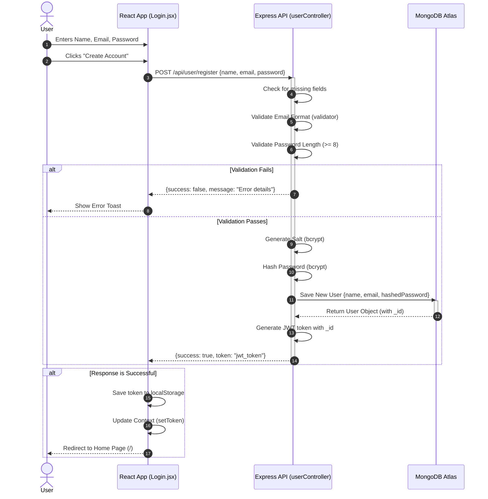

# 📝 Patient Registration Flow

This document explains the complete, end-to-end process of what happens when a new patient creates an account on the **Prescripto** platform.

## 🔄 The Complete Procedure

### 1. Frontend: User Input
**File:** `frontend/src/pages/Login.jsx`
- The user navigates to the login page and selects the **"Sign Up"** option.
- They fill out a form with their **Full Name**, **Email**, and **Password**.
- Clicking "Create Account" triggers the `onSubmitHandler` function.
- The default browser form submission is prevented (`event.preventDefault()`).

### 2. Frontend: API Request
**File:** `frontend/src/pages/Login.jsx`
- The frontend sends an HTTP `POST` request using `axios` to the backend endpoint `[backendUrl]/api/user/register`.
- The request body contains the user's data: `{ name, email, password }`.

### 3. Backend: Route & Controller
**Route File:** `backend/routes/userRoute.js` (Maps `/register` to the controller)
**Controller File:** `backend/controllers/userController.js` (Function: `registerUser`)
- The request is routed to the `registerUser` function.
- **Validation Steps:**
  - **Missing Data:** Checks if `name`, `email`, and `password` are provided.
  - **Email Format:** Validates the email using the `validator` package (`validator.isEmail()`).
  - **Password Strength:** Ensures the password is at least 8 characters long.
- If any validation fails, the backend immediately returns a response like `{ success: false, message: "Error message" }`.

### 4. Backend: Password Security
**File:** `backend/controllers/userController.js`
- The backend generates a secure salt with a cost factor of 10 (`bcrypt.genSalt(10)`).
- The plain-text password is mathematically hashed using this salt (`bcrypt.hash(password, salt)`).

### 5. Backend: Database Storage
**Model File:** `backend/models/userModel.js`
**Controller File:** `backend/controllers/userController.js`
- A new user object is constructed with the `name`, `email`, and the **hashed password**.
- This object is saved as a new document in the MongoDB Atlas database (`newUser.save()`).

### 6. Backend: Authentication Token
**File:** `backend/controllers/userController.js`
- A JSON Web Token (JWT) is generated using `jwt.sign()`.
- The payload of the token contains the newly created user's unique database ID (`{ id: user._id }`).
- The token is signed securely using the `JWT_SECRET` environment variable.
- The backend sends a successful response back to the frontend: `{ success: true, token: "..." }`.

### 7. Frontend: Completing the Flow
**Component File:** `frontend/src/pages/Login.jsx`
**Context File:** `frontend/src/context/AppContext.jsx`
- The frontend receives the response in the `onSubmitHandler`.
- If `success` is true, the `token` is saved to the browser's `localStorage` to keep the user logged in across page reloads.
- The application's global state is updated with the new token (`setToken(data.token)`).
- A `useEffect` hook detects that the token is now set and automatically redirects (`navigate('/')`) the user to the home page.
- If there was an error during the process, a popup notification (`toast.error()`) displays the error message to the user.

---

## 📊 Process Flowchart

Below is a detailed Mermaid flowchart visualizing the step-by-step registration process. It highlights the Frontend, Backend, and Database layers.

---

## 🔄 Sequence Diagram

Below is a detailed Mermaid sequence diagram visualizing the registration flow across the different layers of the application over time.

---

## 💡 Top 15 Interview Questions on Registration Flow

Here is a curated list of 15 technical interview questions (and answers) a recruiter or senior engineer might ask you about this specific Create Account / Registration implementation:

### Frontend & Network
**Q1. How do you prevent the browser from reloading the page when a user submits the registration form?**
> **Answer:** By passing the `event` object to the `onSubmitHandler` function and calling `event.preventDefault()`. This stops the default HTML form submission behavior and allows us to handle it manually with JavaScript/Axios.

**Q2. Why do you manage the form inputs with multiple `useState` hooks instead of a single object state or a `useRef`?**
> **Answer:** Using individual `useState` hooks (`name`, `email`, `password`) is straightforward and easy to read for simple forms. `useRef` is uncontrolled and doesn't trigger re-renders on every keystroke, which is fine, but controlled components (via `useState`) allow for real-time validation if needed later.

**Q3. Why did you choose Axios over the native `fetch` API for making the HTTP request?**
> **Answer:** Axios automatically parses JSON responses, throws errors for non-2xx HTTP status codes (which `fetch` doesn't do by default), and makes it easier to set up global interceptors for attaching the JWT token to future requests.

**Q4. What is the purpose of the `AppContext` and `setToken` in your frontend?**
> **Answer:** It acts as global state management (using React's Context API). It allows the entire application to know whether a user is logged in (has a token) without needing to pass the token down through multiple layers of props (prop drilling).

**Q5. How do you programmatically redirect the user to the home page after a successful signup?**
> **Answer:** I use the `useNavigate` hook from `react-router-dom`. Inside a `useEffect` hook that listens to the `token` state, if the `token` exists, it triggers `navigate('/')`.

### Backend & Validation
**Q6. How does your backend validate the email address format, and why shouldn't we trust frontend validation alone?**
> **Answer:** The backend uses the `validator` NPM package (`validator.isEmail()`). We can never trust frontend validation alone because malicious users can easily bypass the frontend (using Postman or CURL) and send bad data directly to our API.

**Q7. If the backend throws an error during registration (e.g., the email already exists in the database), how is it handled and shown to the user?**
> **Answer:** The backend returns a response with `{ success: false, message: "Error details" }`. The frontend's `try/catch` block receives this, checks if `success` is false, and triggers a `toast.error(data.message)` to show a user-friendly popup notification.

### Security & Authentication
**Q8. What is `bcrypt` and why did you use it for passwords?**
> **Answer:** `bcrypt` is a password-hashing function. We never store plain-text passwords in the database. `bcrypt` is specifically designed to be computationally slow, making it extremely difficult for hackers to perform brute-force or dictionary attacks.

**Q9. What is a cryptographic "salt" and why do you generate one (`bcrypt.genSalt(10)`)?**
> **Answer:** A salt is random data added to a password before it's hashed. This ensures that even if two users have the exact same password (like "password123"), their final hashed strings in the database will look completely different. It defends against Rainbow Table attacks.

**Q10. What is the difference between Hashing and Encryption? Why don't we encrypt passwords?**
> **Answer:** Encryption is a two-way function (data can be decrypted back to its original form with a key). Hashing is a one-way function. Passwords should be hashed because no one (not even the database administrators) should be able to reverse-engineer the original password.

**Q11. What is a JSON Web Token (JWT) and what does it consist of?**
> **Answer:** A JWT is a standard for securely transmitting information as a JSON object. It consists of three parts: a Header, a Payload, and a Signature. It allows for stateless authentication, meaning the server doesn't need to keep a session store; it just verifies the signature.

**Q12. Why do you put only the `user._id` in the JWT payload and not the whole user object or their password?**
> **Answer:** Two reasons: First, to keep the token size small since it's sent with every HTTP request. Second, the JWT payload is only Base64 encoded, not encrypted. Anyone can decode it, so sensitive data (like passwords or private info) should never be put inside the payload.

### Database & Production Readiness
**Q13. How do you securely store the JWT token on the frontend after a successful registration?**
> **Answer:** Currently, it is stored in `localStorage`. While this is very common and easy to implement, it is vulnerable to Cross-Site Scripting (XSS) attacks. For a strict production environment, storing the token in an `HttpOnly` cookie is more secure.

**Q14. How would you handle a scenario where two users try to register with the exact same email at the exact same millisecond?**
> **Answer:** The MongoDB schema for `users` has the `email` field set to `{ unique: true }`. MongoDB enforces this constraint at the database level. The first request will succeed, and the second request will throw a duplicate key error (code 11000), which the backend will catch and send back as an error message.

**Q15. How would you improve the security and robustness of this registration flow for a real-world production environment?**
> **Answer:** I would add three things: 
> 1. **Rate Limiting:** To prevent bots from creating thousands of spam accounts per minute.
> 2. **Email Verification:** Sending an OTP or verification link to ensure the email is real before activating the account.
> 3. **Stronger Password Policies:** Using regex to enforce uppercase, numbers, and special characters.
