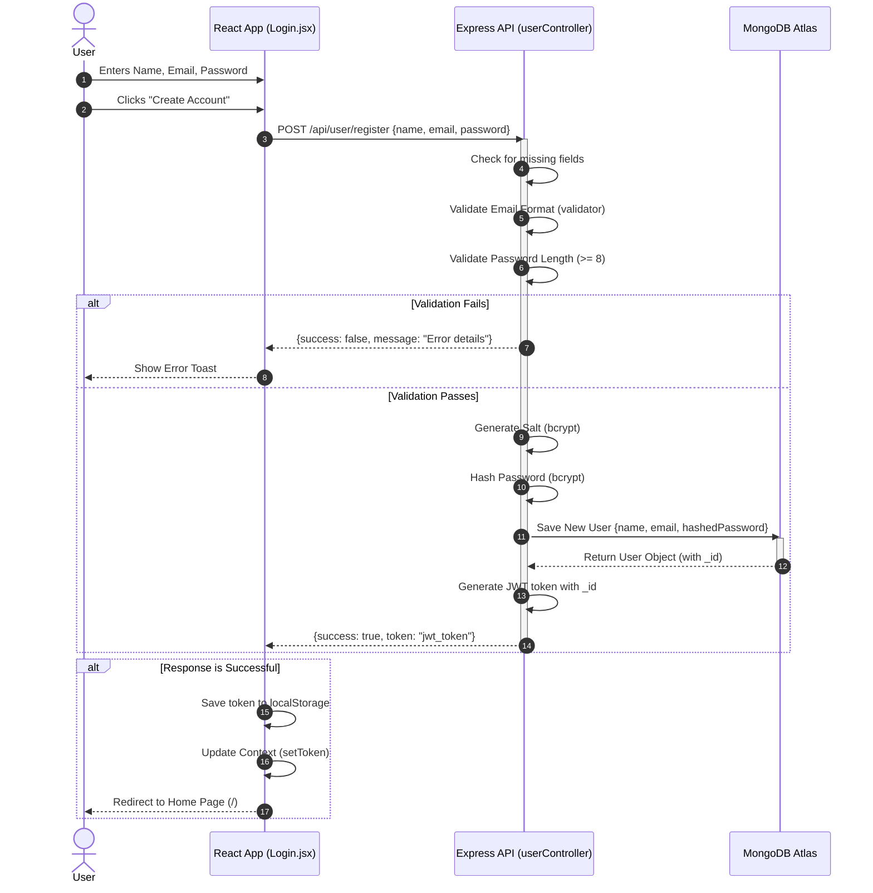
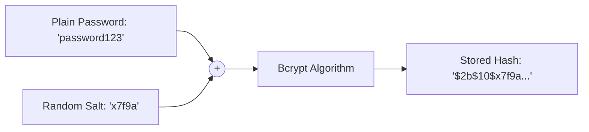
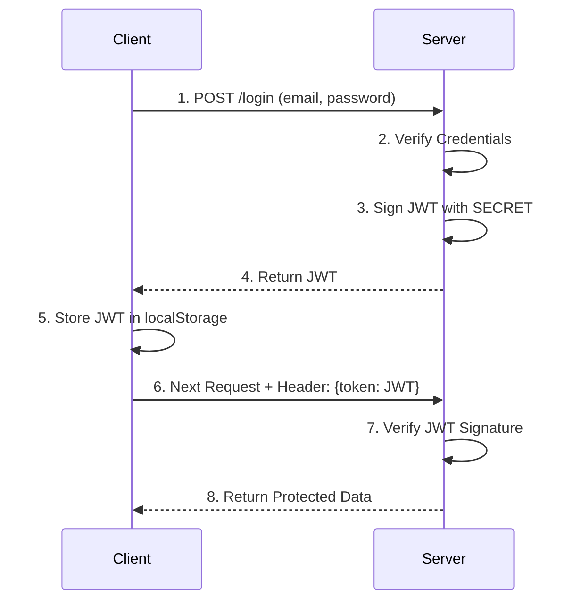

# 📝 Patient Registration Flow

This document explains the complete, end-to-end process of what happens when a new patient creates an account on the **Prescripto** platform.

## 🔄 The Complete Procedure

### 1. Frontend: User Input
**File:** `frontend/src/pages/Login.jsx`
- The user navigates to the login page and selects the **"Sign Up"** option.
- They fill out a form with their **Full Name**, **Email**, and **Password**.
- Clicking "Create Account" triggers the `onSubmitHandler` function.
- The default browser form submission is prevented (`event.preventDefault()`).

### 2. Frontend: API Request
**File:** `frontend/src/pages/Login.jsx`
- The frontend sends an HTTP `POST` request using `axios` to the backend endpoint `[backendUrl]/api/user/register`.
- The request body contains the user's data: `{ name, email, password }`.

### 3. Backend: Route & Controller
**Route File:** `backend/routes/userRoute.js` (Maps `/register` to the controller)
**Controller File:** `backend/controllers/userController.js` (Function: `registerUser`)
- The request is routed to the `registerUser` function.
- **Validation Steps:**
  - **Missing Data:** Checks if `name`, `email`, and `password` are provided.
  - **Email Format:** Validates the email using the `validator` package (`validator.isEmail()`).
  - **Password Strength:** Ensures the password is at least 8 characters long.
- If any validation fails, the backend immediately returns a response like `{ success: false, message: "Error message" }`.

### 4. Backend: Password Security
**File:** `backend/controllers/userController.js`
- The backend generates a secure salt with a cost factor of 10 (`bcrypt.genSalt(10)`).
- The plain-text password is mathematically hashed using this salt (`bcrypt.hash(password, salt)`).

### 5. Backend: Database Storage
**Model File:** `backend/models/userModel.js`
**Controller File:** `backend/controllers/userController.js`
- A new user object is constructed with the `name`, `email`, and the **hashed password**.
- This object is saved as a new document in the MongoDB Atlas database (`newUser.save()`).

### 6. Backend: Authentication Token
**File:** `backend/controllers/userController.js`
- A JSON Web Token (JWT) is generated using `jwt.sign()`.
- The payload of the token contains the newly created user's unique database ID (`{ id: user._id }`).
- The token is signed securely using the `JWT_SECRET` environment variable.
- The backend sends a successful response back to the frontend: `{ success: true, token: "..." }`.

### 7. Frontend: Completing the Flow
**Component File:** `frontend/src/pages/Login.jsx`
**Context File:** `frontend/src/context/AppContext.jsx`
- The frontend receives the response in the `onSubmitHandler`.
- If `success` is true, the `token` is saved to the browser's `localStorage` to keep the user logged in across page reloads.
- The application's global state is updated with the new token (`setToken(data.token)`).
- A `useEffect` hook detects that the token is now set and automatically redirects (`navigate('/')`) the user to the home page.
- If there was an error during the process, a popup notification (`toast.error()`) displays the error message to the user.

---

## 📊 Process Flowchart

Below is a detailed Mermaid flowchart visualizing the step-by-step registration process. It highlights the Frontend, Backend, and Database layers.

---

## 🔄 Sequence Diagram

Below is a detailed Mermaid sequence diagram visualizing the registration flow across the different layers of the application over time.

---

## 💡 The Ultimate 30 Interview Questions (Masterclass)

Here is a comprehensive list of **30 technical interview questions** that cover every possible angle of this Registration Flow. If you can answer these, an interviewer cannot stump you on this topic.

### 🟢 Frontend & Network
**Q1. How do you prevent the browser from reloading the page when a user submits the registration form?**
> **Answer:** By passing the `event` object to the `onSubmitHandler` function and calling `event.preventDefault()`. This stops the default HTML form submission behavior, allowing Axios to handle it silently.

**Q2. Why manage form inputs with multiple `useState` hooks instead of a single object state or a `useRef`?**
> **Answer:** Individual `useState` hooks (`name`, `email`, `password`) are straightforward and easy to read. `useRef` is uncontrolled and doesn't trigger re-renders, whereas controlled components (via `useState`) allow for real-time keystroke validation if needed.

**Q3. Why did you choose Axios over the native `fetch` API?**
> **Answer:** Axios automatically parses JSON responses, throws errors for non-2xx HTTP status codes (which `fetch` doesn't do), and makes it trivial to set up global interceptors for attaching the JWT token to future requests.

**Q4. What is the purpose of the `AppContext` and `setToken` in your frontend?**
> **Answer:** It acts as global state management (React Context API). It allows the entire app to know whether a user is logged in without passing the token down through multiple layers of props (prop drilling).

**Q5. How do you programmatically redirect the user to the home page after a successful signup?**
> **Answer:** I use the `useNavigate` hook. Inside a `useEffect` hook listening to the `token` state, if the `token` exists, it triggers `navigate('/')`.

**Q6. What happens if the backend server is down when the user clicks 'Create Account'?**
> **Answer:** Axios will throw a Network Error. The `try/catch` block in `onSubmitHandler` catches this error, and `toast.error(error.message)` displays a friendly notification to the user instead of crashing the app.

**Q7. Why do you use a single `onSubmitHandler` for both Login and Signup?**
> **Answer:** For code reusability. The `state` variable ("Sign Up" or "Login") dictates which API endpoint is hit, but the error handling and token saving logic is identical for both.

**Q8. Why use `toast.error(data.message)` instead of the native `alert()`?**
> **Answer:** Better UX (User Experience). Native alerts block the main JavaScript thread and are visually jarring. Toasts are asynchronous and look professional.

**Q9. How would you implement client-side validation to reduce unnecessary API calls?**
> **Answer:** Before calling `axios.post`, I would write an `if` statement checking if `password.length < 8` or testing the email against a Regex pattern. If it fails, I show a toast error immediately, saving server bandwidth.

### 🔵 Backend & API Design
**Q10. How does your backend validate the email address format?**
> **Answer:** The backend uses the popular `validator` NPM package (`validator.isEmail()`). 

**Q11. Why shouldn't we trust frontend validation alone?**
> **Answer:** Client-side validation can be bypassed by malicious users (e.g., using Postman or cURL). The backend must **always** sanitize and validate incoming data to protect the database.

**Q12. If the backend throws an error (e.g., email already exists), how is it shown to the user?**
> **Answer:** The backend returns a 200 OK response with `{ success: false, message: "..." }`. The frontend's `try/catch` block receives this, checks if `success` is false, and triggers a `toast.error()`.

**Q13. Is checking `password.length < 8` enough for production security?**
> **Answer:** No. A strong password policy should also check for a mix of uppercase letters, numbers, and special symbols using a Regular Expression (Regex).

**Q14. Why doesn't the backend check if the `name` contains only letters?**
> **Answer:** Names are complex. They can have dashes (Smith-Jones), apostrophes (O'Connor), or unicode characters. Strict letter-only validation often blocks legitimate users.

**Q15. What HTTP status code does your backend return when validation fails, and how would you improve it?**
> **Answer:** Currently, it returns a `200 OK` with a `success: false` flag. A more RESTful approach would be to return a `400 Bad Request` for validation errors, and `409 Conflict` for duplicate emails.

**Q16. How do you parse the incoming JSON payload in your Express app?**
> **Answer:** Using the built-in `express.json()` middleware in `server.js`, which parses the incoming request body into `req.body`.

### 🟣 Security & Authentication
**Q17. What is `bcrypt` and why did you use it for passwords?**
> **Answer:** `bcrypt` is a password-hashing function. It is specifically designed to be computationally slow, making it extremely difficult for hackers to perform brute-force or dictionary attacks on the database.

**Q18. What is a cryptographic "salt" and why do you generate one (`bcrypt.genSalt(10)`)?**
> **Answer:** A salt is random data added to a password before hashing. This ensures that even if two users have the exact same password, their final hashes will look completely different, defending against Rainbow Table attacks.

**Q19. Draw how bcrypt hashing works with a Salt.**
> **Answer:**

**Q20. What is the difference between Hashing and Encryption?**
> **Answer:** Encryption is a two-way function (data can be decrypted back to its original form with a key). Hashing is a one-way function. Passwords should be hashed because no one (not even DB admins) should be able to reverse-engineer them.

**Q21. What is a JSON Web Token (JWT) and what does it consist of?**
> **Answer:** A JWT is a standard for securely transmitting information. It consists of three parts: Header, Payload, and Signature. It allows for stateless authentication—the server verifies the signature without needing a session database.

**Q22. Draw the lifecycle of a JWT Authentication flow.**
> **Answer:**

**Q23. Why do you put only the `user._id` in the JWT payload and not their password?**
> **Answer:** The JWT payload is only Base64 encoded, not encrypted. Anyone can decode it, so sensitive data must never be put inside it. Also, keeping the payload small reduces network bandwidth.

**Q24. What happens if the `JWT_SECRET` is leaked?**
> **Answer:** It's a critical security breach. Attackers can forge valid tokens for any user (even admins) without knowing their passwords. The secret must be changed immediately, which invalidates all existing tokens.

**Q25. How long is your JWT valid for, and how do you set an expiration?**
> **Answer:** Currently, there is no expiration set in `jwt.sign()`, meaning it lasts forever. In production, we should pass an options object like `jwt.sign(payload, secret, { expiresIn: '1d' })` to force users to re-login periodically.

### 🟠 Database & Production Readiness
**Q26. How do you securely store the JWT token on the frontend?**
> **Answer:** It is currently stored in `localStorage`. While easy, it is vulnerable to Cross-Site Scripting (XSS). For a strict production app, returning the token in an `HttpOnly` cookie is significantly safer because JavaScript cannot access it.

**Q27. How would you handle a scenario where two users try to register with the exact same email at the exact same millisecond?**
> **Answer:** The MongoDB schema for `users` sets the `email` field to `{ unique: true }`. MongoDB enforces this constraint at the database level. The first request succeeds, and the second throws a duplicate key error (code 11000).

**Q28. How would you prevent a bot or malicious user from creating 1,000 accounts per minute?**
> **Answer:** I would implement Rate Limiting on the backend using a package like `express-rate-limit`, restricting the `/register` endpoint to a maximum of 5 requests per IP address every 15 minutes.

**Q29. What is the risk of logging `console.log(error)` in production during registration?**
> **Answer:** It might accidentally log sensitive payload data (like plain-text passwords) or internal database structures to the server logs. In production, we should use a proper logging library (like Winston) that scrubs sensitive info.

**Q30. If the MongoDB database is disconnected, what error does `newUser.save()` throw?**
> **Answer:** Mongoose will throw a `MongoNotConnectedError`. The `try/catch` block will catch it, and the API will return `{ success: false, message: "MongoNotConnectedError..." }`. (In production, we should sanitize this error before sending it to the client).
